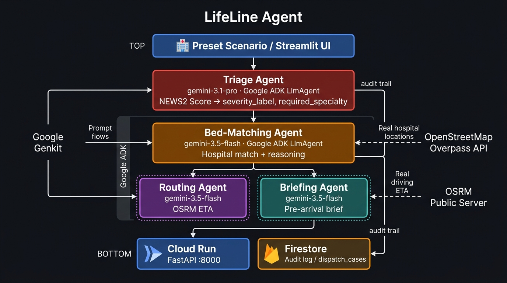

# 🚑 LifeLine Agent

> **Autonomous Emergency & Hospital Bed Matchmaker** — an AI multi-agent pipeline that matches incoming emergency cases to the right hospital in seconds, not minutes.

[](https://allthingsagentichackathon.devpost.com/)
[](https://allthingsagentichackathon.devpost.com/)
[](https://ai.google.dev/models)
[](https://github.com/google/adk-python)
[](https://cloud.google.com/)

---

## 🎯 Problem & Value Proposition

Every minute a paramedic spends on hold with hospitals is a minute a critical patient is not receiving treatment. Manual emergency dispatch — phone calls, spreadsheets, radio coordination — introduces deadly latency at exactly the wrong moment.

**LifeLine Agent eliminates that latency.** It autonomously:
- Computes a real clinical triage score (NEWS2) from patient vitals
- Reasons over that score to determine severity and required specialty
- Matches the patient to the optimal available hospital using real location data and real driving ETAs
- Writes a pre-arrival brief for the receiving team
- Logs every decision to an immutable, timestamped audit trail

Zero phone calls. Zero hold music. Seconds, not minutes.

---

## 🏆 Category: The Taskmaster

LifeLine Agent is built for **The Taskmaster** track because it is a fully autonomous multi-step agent pipeline — not a chatbot, not a single LLM call. It orchestrates four sequential specialist agents, each with a defined input schema, output schema, and tool access, completing a complex real-world workflow without any human intervention in the decision loop.

---

## 🏗️ Architecture Diagram



### How it flows

```
[Preset Scenario / React + Vite (TypeScript) UI]
         │
         ▼
┌─────────────────────┐   NEWS2 score (real formula) + Gemini 3.1 Pro reasoning
│    Triage Agent      │──────────────────────────────────────────────────────▶
│  (ADK LlmAgent)      │   → { severity_label, required_specialty, notes }
└─────────────────────┘
         │
         ▼
┌─────────────────────┐   Real hospitals: OpenStreetMap Overpass API
│  Bed-Matching Agent  │   Real ETAs: OSRM public server
│  (ADK LlmAgent)      │   Simulated: bed counts & specialties
└─────────────────────┘   → { chosen_hospital, reasoning, alternatives[] }
         │
    ┌────┴────┐
    ▼         ▼
[Routing]  [Briefing]   ← STRETCH (gemini-3.5-flash)
    │         │
    └────┬────┘
         ▼
[Cloud Run FastAPI] ──── POST /dispatch
         │
    [Firestore] ──────── dispatch_cases (audit trail)
```

---

## 🧰 Tech Stack

| Layer | Technology |
|---|---|
| **LLM — Triage** | `gemini-3.1-pro` via Gemini API |
| **LLM — All other agents** | `gemini-3.5-flash` via Gemini API |
| **Agent Framework** | Google ADK (`LlmAgent`, `SequentialAgent`) |
| **Prompt / Flow Management** | Google Genkit |
| **Auth** | Firebase Authentication |
| **Database / Audit Log** | Cloud Firestore (Firebase Admin SDK) |
| **API Server** | FastAPI on Google Cloud Run |
| **Hospital Locations** | OpenStreetMap Overpass API (free, no key) |
| **Routing / ETA** | OSRM public demo server (free, no key) |
| **Triage Formula** | NEWS2 — Royal College of Physicians (public standard) |
| **Frontend** | React + Vite (TypeScript) |
| **CLI** | Typer + Rich |
| **Packaging** | `pyproject.toml` (hatchling), `pip install -e .` |

---

## ✨ Features & Functionality

- **Real NEWS2 Scoring** — patient vitals run through the clinically validated National Early Warning Score 2 formula before any LLM sees them. The agent reasons over a real number, not a guess.
- **Autonomous 2-Agent Pipeline** — Triage → Bed-Matching chain orchestrated by Google ADK `SequentialAgent`. Agents hand off structured Pydantic schemas, not plain text.
- **Real Hospital Data** — hospital names and GPS coordinates fetched from OpenStreetMap via the free Overpass API for any city.
- **Real Driving ETAs** — OSRM public server provides actual road-network distance and drive time for hospital ranking.
- **Immutable Audit Trail** — every dispatch run (inputs + all agent outputs) is written to Firestore with a UTC timestamp. HIPAA-defensible audit log design.
- **Super Admin Panel** — React + Vite (TypeScript) UI for securely setting API keys (AES-256 encrypted at rest, Firebase Auth login, never hardcoded).
- **One-command Install** — `pip install -e .` registers the `lifeline` CLI globally.

---

## 📊 Data Sources — Real vs. Simulated

| Component | Source | Status |
|---|---|---|
| Hospital names & GPS coordinates | OpenStreetMap Overpass API | ✅ **Real** |
| Triage scoring formula (NEWS2) | Royal College of Physicians public standard | ✅ **Real** |
| Driving distance & ETA | OSRM public demo server | ✅ **Real** |
| Agent reasoning & orchestration | Gemini 3.5-flash / 3.1-pro via ADK | ✅ **Real** |
| Bed counts (ICU / general / surgical) | `lifeline seed` script (randomized, plausible) | ⚠️ **Simulated** |
| Hospital specialties | `lifeline seed` script | ⚠️ **Simulated** |

> **Why simulated beds?** Real-time bed availability requires direct EHR integration (HL7/FHIR) with private hospital systems. This is explicitly out of scope for a hackathon and documented as future work.

---

## 🚀 Spin-up Instructions

### Prerequisites

| Tool | Version | Link |
|---|---|---|
| Python | ≥ 3.11 | [python.org](https://python.org) |
| Git | any | [git-scm.com](https://git-scm.com) |
| Docker (optional, for Cloud Run) | ≥ 24 | [docker.com](https://docker.com) |
| gcloud CLI (optional, for deploy) | latest | [cloud.google.com/sdk](https://cloud.google.com/sdk) |

---

### Local Setup (5 steps)

**Step 1 — Clone & install**
```bash
git clone https://github.com/your-org/lifeline-agent.git
cd lifeline-agent
pip install -e ".[dev]"
# The 'lifeline' CLI is now available globally
lifeline --help
```

**Step 2 — Configure API keys via the Admin Panel**
```bash
lifeline admin
# Opens http://localhost:5173 in your browser
```
On first launch, the setup wizard appears:
1. Create your **admin email + password** (stored in Firebase Auth — never on disk in plain text)
2. Log in
3. Go to **🔑 API Keys** tab and fill in:

| Key | Where to get it |
|---|---|
| `Gemini API Key` | [aistudio.google.com/apikey](https://aistudio.google.com/apikey) |
| `GCP Project ID` | [console.cloud.google.com](https://console.cloud.google.com) |
| `Firebase Web API Key` | Firebase Console → Project Settings → General |
| `Firebase Service Account JSON` | Firebase Console → Project Settings → Service Accounts → Generate New Key → paste full JSON |
| `Firestore Collection` | `dispatch_cases` (or any name you choose) |
| `Demo City` | `mumbai` (or `london`, `seattle`, `delhi`, `bangalore`) |

**Step 3 — Pull real hospital data**
```bash
lifeline fetch-hospitals --city mumbai
# Saves: data/hospitals_raw.json  (real OSM hospital locations)

lifeline seed
# Saves: data/hospitals.json  (enriched with simulated bed data)

# Or run both with:
make data CITY=mumbai
```

**Step 4 — Start the API server**
```bash
lifeline run
# API running at http://localhost:8000
# Interactive docs at http://localhost:8000/docs
# Health check: curl http://localhost:8000/health
```

**Step 5 — Launch the demo UI**
```bash
lifeline ui
# Opens React + Vite (TypeScript) at http://localhost:5173
# Pick a scenario from the dropdown → click Dispatch → watch agents run
```

---

### Cloud Run Deployment

**Step 1 — Authenticate**
```bash
gcloud auth login
gcloud config set project YOUR_PROJECT_ID
```

**Step 2 — Build & deploy**
```bash
make docker-build
make deploy
# Or manually:
gcloud run deploy lifeline-agent \
  --source . \
  --region us-central1 \
  --allow-unauthenticated
```

**Step 3 — Set environment variables on Cloud Run**

In GCP Console → Cloud Run → lifeline-agent → Edit & Deploy → Variables:
- `GEMINI_API_KEY`
- `FIREBASE_WEB_API_KEY`
- `GCP_PROJECT_ID`
- `FIRESTORE_COLLECTION=dispatch_cases`
- `DEMO_CITY=mumbai`
- `GOOGLE_APPLICATION_CREDENTIALS` (or attach a service account to the Cloud Run service)

---

### Run Tests
```bash
make test
# or: pytest tests/ -v --cov=lifeline
```

---

## 🎬 Demo Video

> 📺 **[Watch the demo on YouTube](https://youtube.com/your-link-here)** *(link added post-recording)*

The demo shows 3 live scenarios run end-to-end:
1. **Mild** — ankle sprain, NEWS2 low → general hospital nearby
2. **Critical Cardiac** — chest pain, low BP, high NEWS2 → cardiac-capable hospital
3. **Critical Trauma** — motorcycle collision, confused patient → trauma center despite longer ETA

---

## 💡 Findings & Learnings

- **NEWS2 as a grounding anchor works.** Giving the Triage Agent a real clinical number prevents hallucinated severity labels. The model respects the score — a NEWS2 of 12 always maps to critical.
- **ADK's output schemas are powerful.** Pydantic schemas as `output_schema` force the model to produce machine-parseable JSON, making agent handoffs reliable without string parsing hacks.
- **Free APIs are demo-day fragile.** Overpass and OSRM are unmetered public instances. We cache their results to `data/` immediately after the first successful pull. Demo-day availability is not guaranteed, but cached data always is.
- **Simulated data needs tuning.** Uniform random bed counts look fake. A small asymmetric randomization (`randint(1,12) - randint(0,3)`) produces plausible variation including 0-bed scenarios that stress-test the matching logic.
- **Firebase Auth is the right choice for admin credential management.** Eliminates local password storage entirely — no bcrypt files, no plain-text passwords, no credential leakage risk.

---

## 🔭 Future Work (Explicitly Out of Scope for This Submission)

- **Real HL7/FHIR Integration** — connect to actual hospital EHR systems for live bed availability
- **Human-in-the-Loop Destination Lock** — paramedic confirms or overrides the agent's hospital choice before dispatch is finalised
- **Real-Time Ambulance Telemetry** — ingest live GPS + vitals from ambulance hardware
- **Multi-Region Surge Management** — coordinate across regional hospital networks during mass-casualty events
- **Liability & Audit Framework** — legal wrapper for automated medical routing decisions
- **Native Mobile App** — paramedic-facing iOS/Android app for hands-free vitals reporting

---

## 📁 Repository Structure

```
lifeline-agent/
├── lifeline/               ← Installable Python package
│   ├── __init__.py         ← version = "0.1.0"
│   ├── cli.py              ← 'lifeline' CLI (Typer)
│   ├── models.py           ← Gemini model registry
│   ├── firebase.py         ← Firebase Admin SDK bootstrap
│   ├── schemas.py          ← Pydantic I/O schemas
│   ├── orchestrator.py     ← Pipeline runner
│   ├── main.py             ← FastAPI app (POST /dispatch)
│   ├── agents/
│   │   ├── triage_agent.py
│   │   ├── bed_matching_agent.py
│   │   ├── routing_agent.py    ← STRETCH
│   │   └── briefing_agent.py   ← STRETCH
│   └── tools/
│       ├── news2.py            ← NEWS2 scoring (pure Python)
│       ├── places_api.py       ← OpenStreetMap Overpass API
│       ├── routes_api.py       ← OSRM routing
│       └── firestore_client.py ← Firestore audit log
├── admin/                  ← Super Admin Panel
│   ├── superadmin.py       ← React + Vite (TypeScript) admin UI
│   ├── auth.py             ← Firebase Auth
│   └── config_manager.py   ← AES-256 encrypted config
├── ui/
│   └── React + Vite (TypeScript)_app.py    ← Demo UI (preset scenarios)
├── data/
│   └── demo_cases.json     ← 5 preset scenarios
├── scripts/
│   ├── fetch_hospitals.py
│   └── seed_mock_data.py
├── tests/
├── deploy/
│   └── Dockerfile
├── docs/
│   └── architecture.jpg    ← Architecture diagram
├── my-agent/               ← 📚 Documentation ONLY (.md files)
│   ├── README.md
│   ├── ROADMAP.md
│   └── docs/
├── pyproject.toml          ← Package config (pip install -e .)
├── Makefile                ← All dev commands
└── .env.example            ← Environment variable template
```

---

## 📄 License

Apache 2.0 — see [LICENSE](LICENSE)

